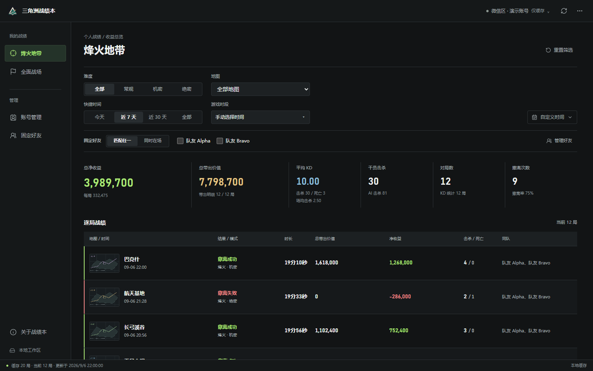

# 三角洲战绩本

[](https://github.com/dming2016/delta-stats-book/actions/workflows/tests.yml)
[](LICENSE)

面向《三角洲行动》玩家的 **Windows 本地战绩复盘工具**。看清烽火净收益，对照固定队友的共同局表现，把每次开黑单独算明白。

**非官方个人项目，与腾讯及《三角洲行动》官方无隶属关系。** 不修改游戏进程，不提供游戏内自动操作。只应读取本人或明确授权使用的账号，使用时遵守游戏、微信及相关服务的条款。内部接口可能随时变化，项目不承诺持续可用或账号使用零风险。

[下载安装版](https://zhou.opendeep.top/) · [版本与源码](https://github.com/dming2016/delta-stats-book/releases) · [报告问题](https://github.com/dming2016/delta-stats-book/issues/new/choose)



## 能做什么

- **烽火复盘**：净收益、带出价值、KD、击杀和撤离表现，按地图、难度、日期筛选。
- **固定队友**：比较实际共同局，支持“匹配任一”和“同时在场”。
- **开黑时段**：自动识别连续对局，单选或多选不同时段。
- **全面战场**：独立展示胜负、得分、KD/KDA、救援与段位趋势，不混用烽火指标。
- **多账号**：微信区、QQ 区分别保存，账号、缓存和偏好互相隔离。
- **本地优先**：先显示缓存，再后台同步；已有历史不会因登录过期而删除。
- **旧缓存可见**：默认查看全部历史；空筛选会提示本机仍有缓存，自动同步失败会保留明显的登录恢复入口。

官方接口没有队友入场成本，因此不计算好友净收益。未知字段不会被当作零值。

## 普通用户

1. 从[下载官网](https://zhou.opendeep.top/)获取 Windows 10/11 安装版。
2. 在**电脑版微信**中打开《三角洲行动》官方小程序，切到需要读取的微信区或 QQ 区账号。
3. 在战绩本中读取当前小程序账号并同步。

QQ 区同样通过电脑版微信承载的小程序读取，不需要电脑版 QQ。没有手机独立版本。

安装版和便携版都支持应用内更新。便携 ZIP 必须完整解压，不要单独移动启动器或 `app` 文件夹。物理启动器仍名为 `三角洲情报助手.exe`，这是旧版更新兼容身份。

## 从源码运行

需要 **Windows x64、Python 3.12**。首次建议使用独立虚拟环境：

```powershell
git clone https://github.com/dming2016/delta-stats-book.git
cd delta-stats-book
py -3.12 -m venv .venv
.\.venv\Scripts\python.exe -m pip install -r requirements.txt
.\.venv\Scripts\python.exe friend_client.py
```

Windows WebView2 Runtime 通常已经安装；若提示缺少运行时，请使用微软官方的 WebView2 安装渠道。源码模式没有构建时嵌入的更新清单，不能直接进行应用内更新。

### 不登录也能预览

```powershell
.\.venv\Scripts\python.exe tools/preview_ui.py --port 4178
```

打开 `http://127.0.0.1:4178/delta-stats-page.html` 查看虚构战绩，根路径是官网预览。这个独立服务不读取真实账号、不请求腾讯接口、拒绝写操作，适合调整界面。

### 测试

安装 Node.js 22 LTS 后运行：

```powershell
.\.venv\Scripts\python.exe -m unittest -v
```

GitHub Actions 在 Windows 上运行相同测试，并验收隔离演示页面。测试使用模拟接口和临时数据，不需要微信登录、生产服务器或任何真实密钥。浏览器测试详见[开发指南](docs/operator-runbook.md)。

## 隐私与数据

正常数据流：

```text
电脑版微信中的官方小程序登录态
  -> 本机查询腾讯接口
  -> 按账号独立缓存
  -> 本机桌面页面
```

- 账号保险箱使用 Windows DPAPI CurrentUser 加密。
- 默认不会向项目服务器上传账号凭据或战绩，服务器只提供下载与版本检查。
- 数据目录为 `%LOCALAPPDATA%\DeltaForceIntelAssistant`。
- 安装版卸载不会主动清除账号和历史缓存。
- 可选共享页是独立工具；只有显式配置并运行 `remote_sync.py` 才会上传整理后的当前账号战绩。
- 不要将保险箱、微信存储、HAR、原始接口响应、完整日志或生产密钥提交到仓库或公开 Issue。

## 构建与二次分发

正式构建入口是 `python build_friend_package.py`，需要 PyInstaller 和 Inno Setup 6.5+，并会重建 `artifacts/local-package/`。具体见[构建说明](docs/operator-runbook.md)。

**Fork 注意**：默认构建的更新地址是上游下载站。分发修改版前，必须配置自己的 `DELTA_UPDATE_BASE_URL`，并检查应用名称、安装 AppId、Mutex、数据目录等身份，避免覆盖上游安装或被上游更新替换。普通贡献者不要为提交补丁改变这些兼容身份。

开源源码以 1.9.0 为起点，并修复英文 Windows 下中文安装路径的启动器替换兼容问题。仓库中的地图缩略图由 [生成脚本](tools/generate_map_placeholders.py) 绘制，是原创通用占位图，不包含从游戏或官方小程序提取的地图美术。演示截图也已重新生成，不能将源码构建视为官网历史 1.9.0 安装包的逐字节副本。

## 参与项目

欢迎修复问题、改进界面、补测试和文档。开始前看 [贡献指南](CONTRIBUTING.md)，安全问题请按 [SECURITY.md](SECURITY.md) 私下报告，不要公开账号凭据或利用细节。

| 文档 | 内容 |
|---|---|
| [架构](docs/architecture.md) | 模块职责、账号状态和统计口径 |
| [接口](docs/integration-guide.md) | 本地 API、时段对象、可选共享 |
| [更新协议](docs/update-protocol.md) | 安装布局、激活、回退和兼容 |
| [开发指南](docs/operator-runbook.md) | 环境、测试、构建和排障 |
| [版本记录](docs/releases.md) | 用户可见变化 |
| [路线图](docs/roadmap.md) | 已知限制与适合参与的方向 |
| [第三方声明](THIRD_PARTY_NOTICES.md) | 素材来源和依赖许可 |

## 许可证

项目原创代码按 [MIT](LICENSE) 开源，允许使用、修改和分发，须保留版权与许可声明。第三方代码和素材遵守各自许可证；游戏名称、商标和官方素材的权利不因本项目开源而授予。软件按现状提供，无担保。
